# 摘要

# Abstract

# 目录
* **摘要**
* **Abstract**
* **目录**
* **[第一章 绪论](#1)**
    * [选题背景及意义](#1-1)
    * [论文工作内容](#1-2)
    * [论文组织结构](#1-3)
* **[第二章 相关技术概述](#2)**
    * [游戏引擎](#2-1)
    * [Unity 游戏引擎](#2-2)
    * [Node.js 运行环境](#2-3)
    * [本章小结](#2-4)
* **[第三章 需求分析](#3)**
    * [业务描述](#3-1)
    * [整体需求](#3-2)
    * [功能需求](#3-3)
        * [主体功能分析](#3-3-1)
        * [场景功能分析](#3-3-2)
        * [关卡功能分析](#3-3-3)
        * [地图编辑功能分析](#3-3-4)
        * [排行榜功能分析](#3-3-5)
    * [用例分析](#3-4)
    * [数据建模](#3-5)
        * [服务端数据建模](#3-5-1)
        * [客户端数据建模](#3-5-2)
    * [本章小结](#3-6)
* **[第四章 游戏及编辑器的设计](#4)**
    * [总体设计](#4-1)
        * [开发环境](#4-1-1)
        * [整体结构设计](#4-1-2)
    * [详细设计](#4-2)
        * [客户端功能模块设计](#4-2-1)
        * [服务端功能模块设计](#4-2-2)
        * [数据库设计](#4-2-3)
        * [数据结构设计](#4-2-4)
    * [本章小结](#4-3)
* **[第五章 游戏及编辑器的功能实现](#5)**
    * [项目工程构建](#5-1)
        * [客户端工程构建](#5-1-1)
        * [服务端工程构建](#5-1-2)
        * [数据库构建](#5-1-3)
    * [客户端通用功能模块](#5-2)
        * [单例模式](#5-2-1)
        * [通用模块实现](#5-2-2)
    * [游戏体验模块实现](#5-3)
        * [游戏体验模块界面实现](#5-3-1)
        * [游戏地图组件实现](#5-3-2)
        * [游戏体验模块管理器实现](#5-3-3)
    * [地图编辑器模块实现](#5-4)
        * [地图编辑器界面实现](#5-4-1)
        * [编辑模式组件实现](#5-4-2)
        * [地图编辑器管理器实现](#5-4-3)
    * 客户端其它模块实现
        * 登录注册
        * 世界排行榜
    * 服务端实现
        * 请求处理响应模块
        * 数据库读写模块
        * 接口逻辑实现模块
    * 本章小结
* **第六章 功能测试**
    * 实际运行效果
        * 运行环境介绍
        * 运行截图
    * 性能测试结果记录
    * 后续工作展望
        * 丰富游戏元素
        * 编辑器易用性的改进
        * 支持桌面端和移动端跨平台
    * 本章小结
* **结论**
* **致谢**
* **参考文献**

# <div id="1"> 第一章 绪论
## <div id="1-1"> 1.1 选题背景及意义 
目前中国国内游戏产业的发展较为迅速，《2018年中国游戏产业报告》指出中国游戏市场2018年实际销售收入达2144.4亿元，同比增长5.3%，相比2017年23%的增速有所放缓。其中，移动游戏市场实际销售收入占中国游戏市场的比例已经高达62.5%。与移动游戏市场保持增长和收入占比持续增加相反，2018年中国客户端游戏市场实际销售收入同比下降4.5%，在整个游戏市场的份额也从2017年的31.9%下降至28.9%。

从报告中可以看出，中国游戏市场仍然处于增长趋势，但是增幅的变缓和客户端游戏份额的下跌，也体现出了目前游戏产业所遇到的瓶颈。近几年，经典玩法游戏的创新匮乏，像诸如《超级马里奥》这样的二维跳台类游戏，只通过经典的关卡式玩法已经不足以维持玩家的热度。而针对二维跳台类游戏的创新，也有很好的成功案例，例如腾讯推出的手机游戏《天天酷跑》，通过扩充游戏玩法，再与社交关系链结合，成功收获了大量用户。

在近一年的软件日活跃用户排名中，前十名中有两位是短视频类软件，即抖音和快手，二者的共同特点都是 “内容创作与分享”，这说明内容创作与分享已然成为目前非常受欢迎的一种模式。将传统二维跳台类游戏与这种模式相结合，进行二次创新，其中 “内容创作” 就是玩家可以自主编辑地图、创造地图，“分享” 就是通过网络共享所有玩家的创作，并利用一些手段将所有玩家联系起来。目前利用这种方式制作的游戏有任天堂（NINTendo）公司推出的《马里奥制造》，但是由于官方只发布了 WiiU 平台，而在 PC 平台和移动平台上，还没有代表性的作品。所以本课题 “二维跳台类游戏地图编辑器” 这一围绕核心地图编辑器的游戏，在探索经典玩法游戏创新的道路上很有意义。
## <div id="1-2"> 1.2 论文工作内容
本人在项目中担任产品设计、程序实现、测试等一系列工作，工作大致内容如下：
1. 根据题目描述进行需求分析，对游戏玩法和编辑器进行设计。
2. 实现客户端中游戏游玩的部分，主要包括游戏主体、玩法逻辑、组件模块逻辑等。
3. 实现客户端中地图编辑器的部分，主要包括交互界面、编辑逻辑、数据储存等。
4. 实现服务端的功能，主要包括用户数据系统、地图数据系统、与客户端通信等。
5. 将游戏发布到 PC 平台，并在局域网部署服务器，实现游戏和编辑器的正常运行。
## <div id="1-3"> 1.3 论文组织结构
本论文主要研究了《Runner Maker》这款二维跳台类游戏及其地图编辑器的设计与实现。本文组织结构如下：

第一章为绪论部分。通过对去年中国游戏产业的现状的介绍，分析了传统游戏玩法创新的必要性，叙述了本论文的研究意义，并且说明了本人在项目中的主要工作，以及本论文的组织结构。

第二章为相关技术概述。介绍了本项目中所使用到的技术，首先对游戏引擎进行综合概述，然后对所使用的 Unity 引擎及其技术特点进行了基本介绍，最后对本项目服务端中使用的 Node.js 技术进行基本介绍。

第三章为需求分析。首先陈述了本项目的整体需求，然后针对各部分功能需求，通过用例分析、数据建模、过程建模等手段进行了详细的分析。

第四章根据需求分析进行软件设计。首先分析了本项目的整体结构，对其客户端和服务端分别进行功能划分，对各个模块进行详细设计与建模。

第五章为功能实现。首先叙述了游戏核心玩法的实现以及游戏场景模块的实现，然后对编辑器实现和地图构建模块进行了重点叙述，最后依次描述了客户端交互和服务端功能的实现。

第六章为功能测试。包括了游戏玩法测试、编辑器功能测试、服务端功能测试，并分别进行了测试总结。

第七章为结束语。对整个项目的开发以及论文的撰写进行总结，并对未来提出展望。

# <div id="2"> 第二章 相关技术概述
## <div id="2-1"> 2.1 游戏引擎
游戏引擎是指一些已经编写好的可用来编辑电脑游戏程序或者一些交互式图形应用程序的核心组件。这些组件为开发者提供了各种制作游戏时所需要用到的代码库和工具，使开发者可以花费较少的时间来制作游戏程序，减少在底层功能和高复用功能方面的工作，提高了开发效率，降低了开发难度。游戏引擎一般包括以下模块：图形渲染引擎、物理引擎、音效引擎、脚本引擎、资源管理、动画系统、网络系统、可视化编辑器等。

游戏引擎又分通用游戏引擎和专用游戏引擎。通用游戏引擎是指可以用来开发各种类型的游戏或相关图形软件的引擎，这类游戏引擎功能较为全面，使用难度也相对较高。专用游戏引擎是指用来开发特定类型的游戏或相关图形软件的引擎，能力局限性较大，但是对这类特定需求可以提供更完善的功能，同时使用难度相对较低。
## <div id="2-2"> 2.2 Unity 游戏引擎
Unity 是一款由 Unity Technologies 研发的跨平台 2D / 3D 游戏引擎，可用于开发 Windows、MacOS 及 Linux 平台的单机游戏，PlayStation、XBox、Wii、3DS 和 任天堂Switch 等游戏主机平台的视频游戏，或是 iOS、Android 等移动设备的游戏。

Unity 所支持的游戏平台还延伸到了基于 WebGL 技术的 HTML5 网页平台，以及 tvOS、Oculus Rift、ARKit 等新一代多媒体平台。除可以用于研发电子游戏之外，Unity 还是被广泛用于建筑可视化、实时三维动画等类型互动内容的综合型创作工具。

Unity 主要有以下技术特点：
1. 完善的可视化编辑器
    
    Unity 引擎的编辑器采用了 “All in one” 的设计思想，即集所有编辑器于一身，包括场景编辑器、资源编辑器、动画编辑器、材质编辑器、游戏对象编辑器等。加之组件化的设计思路，在编辑游戏对象的组件的时候，就好像是在直接编辑这个对象本身，而不是是在使用一个单独的编辑器，它的材质、碰撞器、从属结构等等。并且 Unity 的场景编辑器具有非常好的实时性，即所见即所得，在游戏运行过程中可以实时进行编辑，编辑器会实时反馈效果，这对开发和调试而言可以大大提高效率。

2. 基于 Mono 的脚本开发模式
    
    Unity 引擎的底层是使用 C/C++ 语言编写的，然而并没有采用 C/C++ 作为上层逻辑开发的语言，原因是 C/C++ 会带来较高的安全风险和较低的开发效率。Mono 是一个基于 .NET Framework 的开源跨平台运行环境，使用 C# 语言进行开发，使用 Mono 桥接高性能的底层引擎和带有内存管理的安全语言，不仅减少了安全隐患，同时也提高了跨平台的能力。

3. 基于组件的对象系统
    
    在传统的设计当中，我们一般会使用 “派生 - 继承” 来描述对象之间的关系，在游戏设计中，会根据游戏对象的需求来添加各种功能，例如渲染、碰撞检测、动画等，这些通用功能都必须要集成到基类当中，造成游戏对象的基类会变得体积非常大。而基于组件的对象系统，就是把每一个基础功能都独立出来形成一个 “组件 Component”，游戏设计中可以根据游戏对象的需要，将这些组件中的一部分组合到游戏对象中，这样提高了代码可复用度，增加了对象系统的灵活度。

4. 跨平台支持
    
    由于 Unity 采用的是基于 Mono 的上层开发模式，Mono 自身就是跨平台的，开发者编写的 C# 代码会先编译成 CIL（中间语言），在不同平台中运行中会再将 CIL 编译为原生指令。

## <div id="2-3"> 2.3 Node.js 运行环境
Node.js 是一个能够在服务器端运行 JavaScript 的开放源代码、跨平台 JavaScript 运行环境。Node.js 由 Node.js基金会持有和维护，并与 Linux 基金会有合作关系。Node.js 采用 Google 开发的 V8 运行代码，使用事件驱动、非阻塞和异步输入输出模型等技术来提高性能，可优化应用程序的传输量和规模。这些技术通常用于数据密集的即时应用程序。

Node.js 大部分基本模块都用 JavaScript 语言编写。在 Node.js 出现之前，JavaScript 通常作为客户端程序设计语言使用，用 JavaScript 写出的程序常在用户的浏览器上运行。Node.js 的出现使 JavaScript 也能用于服务端编程。Node.js 含有一系列内置模块，使得程序可以脱离 Apache HTTP Server 或 IIS，作为独立服务器运行。

Node.js 主要有以下技术特点：
1. 单线程
    
    Node.js 以单线程运行，使用非阻塞 I/O 调用，这样既可以支持数以万计的并发连线，又不会因多线程本身的特点而带来麻烦。众多请求只使用单线程的设计意味着可以用于创建高并发应用程序。Node.js 应用程序的设计目标是任何需要操作 I/O 的函数都使用回调函数。

    这种设计的缺点是，如果不使用 cluster、StrongLoop Process Manager 或 pm2 等模块，Node.js 就难以处理多核或多线程等情况。

2. V8
    
    V8是为 Google Chrome 设计的 JavaScript 运行引擎，Google 于2008年将其开源。V8 用 C++ 编写，它将 JavaScript源代码编译成本地机器码而不是随时解释。

    Node.js 用 libuv 来处理异步事件，而 V8 提供了 JavaScript 的实时运行环境。libuv 是一个网络和文件系统功能的抽象层，既可以用于 Windows 又可以用于匹配 POSIX 标准的系统，例如Linux、macOS 和 Unix。
    
    Node.js 的核心功能被包含进一个 JavaScript 库，并通过 C++ 将各部分与操作系统进行联系。

3. npm
    
    npm 是 Node.js 附带的包管理器。npm 是一个命令行工具，用于从 NPM Registry 中下载、安装 Node.js 程序，同时解决依赖问题。npm 提高了开发的速度，因为它能够负责第三方 Node.js 程序的安装与管理。

4. 统一 API

    Node.js 将浏览器、数据（例如 MongoDB 或 CouchDB）等组合到一起，通过 JSON 提供一个统一的接口。由于前端框架和一些基本的后端开发技术（如 MVC、MVP、MVVM 等）变得流行，Node.js 也支持客户端和服务器端重新利用相同的模型和接口。

5. 事件循环

    Node.js 将其注册到操作系统中，这样可以及时注意到新连接的产生。当新连接产生时，操作系统会产生一个回调。在 Node.js 运行时内部，每个连接都被分配一个小型的堆。与其他服务器程序不同的是，Node.js 不使用进程或线程处理连接，而是采用事件循环来处理并发连接。而且 Node.js 的事件循环不需要手动调用。在回调函数定义之后，服务器进入事件循环。当回调函数均被执行完毕之后，Node.js 结束事件循环。

## <div id="2-4"> 2.4 本章小结
本章主要叙述了本篇论文工作中的主要技术，客户端开发中为游戏引擎技术，服务端开发中为 Node.js，并详细介绍了 Unity 和 Node.js 的技术特点。 

# <div id="3"> 第三章 需求分析
与一般软件开发过程类似，游戏类软件的开发过程中，需求分析是相当重要的一个阶段。需求分析的质量很大程度上决定了项目开发的方向和质量，想要最终得到一个理想的产品，做好需求分析是根本。本章将从功能、风格、定位等方面对该项目进行需求分析。
## <div id="3-1"> 3.1 业务描述
开发一款运行在 Windows 平台上的游戏，游戏核心玩法基于“二维跳台玩法”，核心创意基于“内容创作与分享”，需要有完整的游戏流程、和地图编辑器以及网络共享地图功能。
## <div id="3-2"> 3.2 整体需求
根据导师提出的要求，从整体上看，该项目有以下需求：

1. 二维跳台游戏规则

    二维跳台游戏是一个历史悠久的电子游戏类型，游戏玩家通过操纵交互设备，例如手柄、键鼠、触摸屏等，来控制游戏角色在游戏场景中跳跃、移动，同时游戏角色会与各种各样的地图元素产生不同的交互。

    游戏规则可分为以下三类：一是终点类型，玩家需要成功到达指定目标从而达成通关条件；二是收集类型，场景中没有明确的终点，玩家需要通过游戏交互达成指定的数值条件，例如收集金币、击杀小怪等；三是竞速类型，这种类型属于联网实时多人游戏，多个玩家同处于同一游戏场景中，通过速度比拼的方式判断获胜。

    本项目的游戏部分采用第一种类型，地图中有唯一终点，玩家需要在当前地图规定的时间内抵达终点，超时未抵达或处罚角色死亡均需要重新开始，并且可以根据每个玩家通关所用时长来进行排行。

2. 玩家需要注册登录

    本项目的核心创意是“内容创作与分享”，所以支持用户注册登录和联网是必要需求。用户可以通过注册来获得账号，使用账号进行登录即可进入，地图编辑完成后上传到服务器时，地图的所属者或创作者即为当前登录账号。游玩时也可以看到地图的创作者信息，并且在通关后对通关账号和地图进行相应的记录。

3. 玩家自主编辑地图关卡，并通过网络进行共享

    地图编辑器是该项目的核心内容，玩家在已登录情况下，可以进入地图创作模式，即地图编辑器，通过提供的各种场景组件，来自定义编辑游戏地图，符合标准即可上传到服务端，其他玩家可以通过网络获取到服务端各个玩家所上传的地图关卡。

4. 排行和奖励机制

    为提高用户之间的联系和互动性，提供排行和奖励机制是必要的。玩家可以对地图关卡进行点赞，该数据会同步到对应的用户信息上，然后对所有用户进行排行。同时也对玩家所通过的地图关卡数量进行统计，对其进行排行。这两方面可以同时激励玩家进行创作和游玩。

## <div id="3-3"> 3.3 功能需求
根据对整体需求的详细分析，该项目必须提供多个功能来实现上述需求，以下是对各个功能模块的具体分析。
### <div id="3-3-1"> 3.3.1 主体功能分析
主体功能即该项目的核心流程，是玩家投入时间最长的部分，所以核心流程的体验直接影响到用户的增长和留存。

由于涉及到网络传输以及用户的概念，注册和登录是必不可少的，每一个用户需要正常登录之后方可正是进入游戏以及编辑器，并且在整个流程体验中使用昵称来作为用户标识。该项目在正式开放时，不提供任何自带的游戏体验地图，第一批玩家需要进行创作并发布后，所有玩家方可有可以游玩的地图关卡。

游戏游玩部分，玩家可以实时刷新获取最新的全部网络地图，可以根据创建时间、点赞人数、通关人数等数据对所有地图关卡进行排序，并且可以显示出玩家和当前地图的关系。当玩家选定一个地图关卡后，将进入正式的游玩，玩家需要在倒计时结束前控制角色抵达终点通关，通关失败可以再次尝试或返回。

游戏规则是建立在传统二维跳台类游戏基本规则上的。首先是角色控制，采用左右移动和跳跃的方式，在纵向上不设置下蹲等功能，且每次落地前均不可以再次跳跃。游戏所有碰撞不需要和真实物理一致，不考虑碰撞弹性，横向移动需要设置一定惯性和阻尼来满足手感要求。
### <div id="3-3-2"> 3.3.2 场景功能分析
游戏场景由前景和远景组成，前景即本项目中的地图，远景即背景。

游戏的前景地图是严格的网格化的，首先每一个地图元素，都是标准尺寸的正方形或可拆分为多个正方形的矩形，其次元素的位置和摆放，不是完全自由的，每一个元素都应该严丝合缝地放到对应的网格中。并且，由于地图是玩家自主编辑，开发者对其可控性很低，所以在多个元素所拼成的地图中，元素之间在任何情况下也不能出现逻辑错误和视觉错误，这对游戏体验来说尤为重要。

远景部分，风格要与前景地图相统一，并提供多种样式以供创作者选择。为显示出前后景的区别，并且在游玩过程中凸显出前景地图，远景不干扰玩家视觉，背景将以天空盒的方式呈现，这样相对于玩家视角背景是固定不变的。
### <div id="3-3-3"> 3.3.2 关卡功能分析
游戏每张地图即为一个关卡，有唯一的起始点和终点，单一关卡中失败均重新开始，不设置其它重生点。

地图在编辑时尺寸限定范围较大，对于规模较小的地图，玩家在小范围的活动中就可以观察到整个地图的结构和终点位置，这样很快就会有通关思路，类似于传统的迷宫游戏，在对整体有全面的掌握后再进行尝试和策略分析。而对于规模较大的地图，玩家在游玩的开始不能对整体地图有一个清晰的认识，甚至不知道终点在哪里，如果没有小地图或者方向指示，很容易给人游戏体验极差的感觉。

然而这正是本项目的特点，由于核心创意是“内容创作与分享”，每一张地图关卡都是由玩家创作的，这样在游玩过程中对于玩家来讲对抗的不是 AI 或者游戏开发者，而是其他玩家，这样就间接营造了一个玩家之间竞争的关系。关卡功能上不设置小地图和方向指示，这样玩家打开一个新的地图关卡，他需要通过不断的尝试去探索地图，去寻找终点，而且这当中还很有可能会进入创作者特意设置好的陷阱，需要花费比预期更多的时间才能最终通关。这种设计方式，从最大程度上发掘玩家的创作能力，其创作成果为游戏提供了源源不断的游戏性内容，形成了一个良性循环。
### <div id="3-3-4"> 3.3.2 地图编辑功能分析
地图编辑功能是本项目的核心创意功能，创作与分享中现有创作才能分享，所以这个功能的体验优良尤为重要。

玩家可以进入自己的创作界面，对自己创建的地图关卡进行管理，包括新建、编辑、删除、发布这四个功能。玩家新建地图后，可以对地图的名称、时间限制、尺寸规模进行设置，并且名称和尺寸规模在创建完成后不可更改。在编辑模式中，需要提供一个工具栏来显示游戏元素，和一个网格场景来显示地图。玩家可以通过点击工具栏中的元素按钮或者键盘上的相应快捷键，来切换选择的元素类型，并且当前选择的元素按钮会高亮显示。玩家在网格场景中点击对应位置即可创建当前选择的元素，如果当前元素为空则尝试删除对应位置的元素，并且网格场景是根据玩家操作实时显示的。

在编辑过程中，玩家可以在游戏模式中体验当前编辑的效果，并且地图关卡可以保存到本地，以便于多次编辑。在玩家发布地图的时候，需要对地图进行标准检查，同时需要在最后一次编辑后玩家自己有通关验证，才可以上传的服务端，并且一旦上传到服务端该地图将不可更改或删除。
### <div id="3-3-5"> 3.3.2 排行榜功能分析
排行榜的功能主要是为了加强用户之间的联系，创作和挑战两个角度均给予玩家更多的激励。排行榜主要包含三种，一是地图排行榜，当玩家在游玩模式选择地图的时候，可以看到当前选择地图的通关用时最少的三个用户，并且也可以看到自己的通关状态和用时。二是通关排行榜，该榜单会根据所有用户的通关总数进行排名，玩家可以看到前十名的用户和自己的排名。三是点赞排行榜，该榜单会根据每个用户创作的地图关卡所获得的赞的总数进行排名，玩家同样可以看到前十名的用户和自己的排名。其中通关排行榜和点赞排行榜单独做成世界排行榜界面。
## <div id="3-4"> 3.4 用例分析
如图 3.1 所示，该项目在软件使用过程中只有用户一个参与者，主要包括以下用例：
1. 注册。没有游戏账号的用户需要先进行注册，注册验证后方可获取的合法账号。
2. 登录。该项目需要强制登录，不支持无账号的匿名登录，用户必须拥有合法账号才能登录成功。
3. 获取全部地图。用户可以通过进入开始挑战界面，获取当前服务端的所有用户上传的地图，并且可以预览每个地图关卡的基本信息。
4. 进入游戏。用户在开始挑战界面，选择一个地图关卡并开始挑战，即可进入游戏界面游玩该地图关卡。
6. 暂停游戏。用户在游戏中可以主动暂停游戏，暂停时停止除 UI 界面以外的所有更新。
5. 重玩游戏。用户在游戏中通关、失败后或者暂停时，可以选择重新挑战，选择后会重置当前定图关卡并重新开始。
6. 退出游戏。用户在游戏中通关、失败后或者暂停时，可以选择退出游戏，选择后会退出游戏界面，返回到挑战解码的地图列表。
7. 点赞。用户在游戏通关后，可以选择给当前地图点赞。
8. 点踩。用户在游戏通关后，可以选择给当前地图点踩。
9. 获取我的地图。用户进入我的创造界面，获取该用户本地储存的未上传地图关卡和已经上传的地图关卡，并显示其基本信息。
10. 创建地图。用户点击创建地图，进入新建地图关卡的流程，玩家按照要求输入地图名称、尺寸即可创建一个新的地图关卡。
11. 编辑地图。用户在我的创造界面先选定一个未上传的地图，点击编辑地图，即可进入编辑器界面，用户可以自定义编辑地图的模块和倒计时。
12. 删除地图。用户可以在我的创造界面选定一个未上传的地图关卡，然后点击删除地图即可删除该地图关卡。
13. 上传地图。用户在我的创造界面选定一个未上传的地图关卡，点击上传地图时会检测当前地图关卡配置数据的合法性，若符合要求则将该地图关卡上传到服务端并分享给所有用户。
14. 验证用户信息。在需要用户信息的操作的时候，根据客户端储存的用户登录状态向服务端验证用户信息时候正确。
15. 地图规则验证。用户在编辑器保存时对地图关卡的当前编辑状态进行规则检查。
16. 保存编辑。用户在编辑器界面编辑地图后，可以保存当前编辑的地图关卡信息。
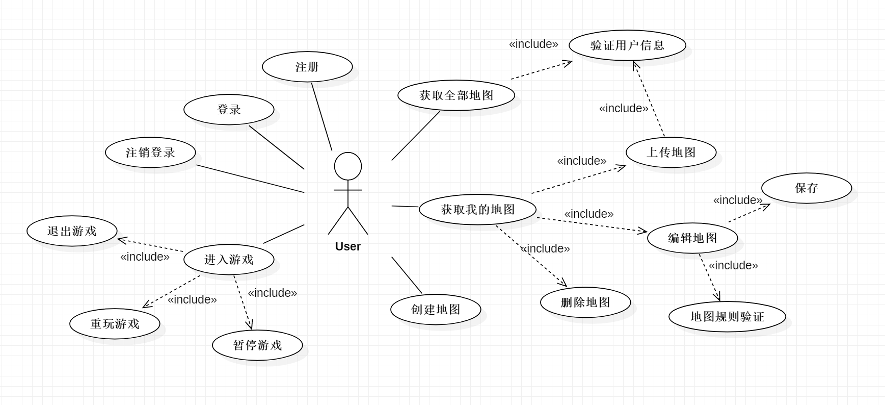
## <div id="3-5"> 3.5 数据建模
该项目的数据包括两部分，其一是存储在服务端数据库的数据，包括用户信息和上传后的地图关卡信息；其二是存储在用户客户端本地的数据，包括用户创建后未上传的地图关卡信息。
### <div id="3-5-1"> 3.5.1 服务端数据建模
服务端数据使用数据库存储，数据建模如图 3.2 所示：
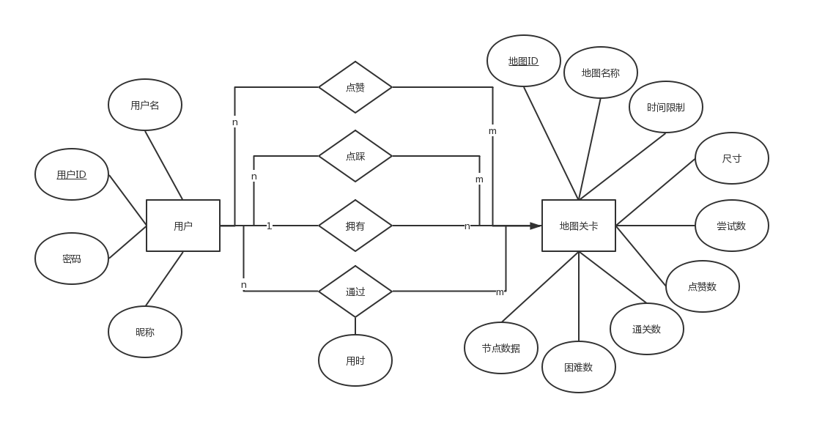

用户实体用来存储用户账号信息，包含以下属性：
1. 用户ID。用户在注册账号的时候自动分配的唯一数字标识，用于区分用户账号。
2. 用户名。用户在注册账号的时候自定义的账号名，该名称是唯一的，用于登录账号。
3. 密码。用户在注册账号的时候自定义的账号密码，用于登录时的验证。
4. 昵称。用户在注册账号时自定义的昵称，昵称可以不唯一，用于在各个用户客户端中展示的名称。

地图关卡实体用来存储地图关卡的描述数据，包含以下属性：
1. 地图ID。上传地图时自动分配的唯一数字标识，用于和其它地图区分。
2. 地图名称。用户创建地图时自定义的地图关卡名称，用于在各个用户客户端中展示的地图名称。
3. 时间限制。用户编辑地图时自定义的通关时间限制，用户其他用户挑战该地图关卡时的倒计时。
4. 尺寸。用户创建地图时自定义的地图尺寸，用于构建地图的边界。
5. 交互数据。用于存储所有用户对该地图关卡的交互数据记录，包括所有用户对其的点赞、困难、通关、尝试数量。
6. 节点数据。用于存储用户编辑后地图的每个节点的数据，用于其他玩家游玩时构建地图。

通关关系包含用户和地图关卡之间的通过信息，包含以下属性：
1. 关系ID。用户在成功通过地图关卡的时候自动分为的唯一数字标识。
2. 用户ID。用户和地图关卡之间通关关系中的用户ID，用于检索用户信息。
3. 地图ID。用户和地图关卡之间通关关系中的地图关卡ID，用户检索地图关卡信息。
4. 用时。用户通过地图关卡的用时，用于通关排行的依据。

点赞关系包含用户和地图关卡之间的所属信息，包含以下属性：
1. 关系ID。用户在给地图点赞的时候自动分配的唯一数字标识。
2. 用户ID。用户和地图关卡之间点赞关系中的用户ID，用于检索用户信息。
3. 地图ID。用户和地图关卡之间点赞关系中的地图关卡ID，用户检索地图关卡信息。

点踩关系包含用户和地图关卡之间的所属信息，包含以下属性：
1. 关系ID。用户在给地图点踩的时候自动分配的唯一数字标识。
2. 用户ID。用户和地图关卡之间点踩关系中的用户ID，用于检索用户信息。
3. 地图ID。用户和地图关卡之间点踩关系中的地图关卡ID，用户检索地图关卡信息。

### <div id="3-5-2"> 3.5.2 客户端数据建模
用户客户端数据使用文件存储，文件目录结构如图 3.3 所示：
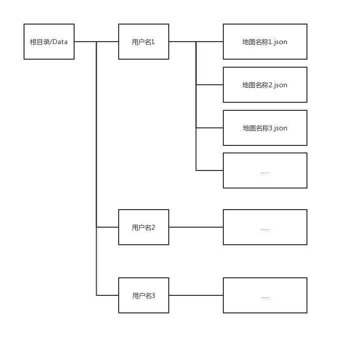

在一台计算机上，安装该项目后，会在程序根目录下的 Data 文件夹中，根据用户名来创建该用户的数据文件夹，当用户使用新的账号登录时，会自动创建以该用户名命名的文件夹。每一个用户的数据文件夹用于存储该用户创建并且未上传的地图关卡数据，每一个地图关卡保存在一个文件中，文件以地图关卡的名称命名。当某一地图关卡被用户上传到服务端后，该地图的客户端数据文件将会被删除。
## <div id="3-6"> 3.6 本章小结
本章采用自顶向下的方式叙述了该项目的需求分析过程，首先从整体入手叙述了基本业务，然后对细化的各个功能模块进行具体分析，并通过用例图、实体-关系图和文件目录结构图对其交互方式和数据存储进行了系统建模，从而完整清晰地对该项目的需求进行了分析，为后续的设计和实现工作指明了方向。

# <div id="4"> 第四章 游戏及编辑器的设计
在进行正式的开发工作之前，需要对该项目整体以及各个系统进行详细的设计。没有一个良好的设计思路和文档，是无法指导开发方向的，从而无法满足需求标准，达不到该项目的预期效果的。本章将对整体和各个系统模块的设计思路进行详细的叙述。
## <div id="4-1"> 4.1 总体设计
### <div id="4-1-1"> 4.1.1 开发环境
| 类型      | 名称     | 版本      |
| :----------: | :------------: | :-----------: |
| 操作系统   | MacOS   | 10.14.3   |
| 开发工具   | Unity   | 2018.3.6  |
| IDE | Visual Studio | 2017 |
| IDE | VS Code | 1.23.1 |
| Runtime | Node.JS | 9.8.0 |
| 数据库 | MySQL | 8.0.15 |
| 语言 | C# | .NET Framework 4.x |
| 语言 | Typescript | 2.8.3 |
| 美术工具 | Photoshop | CC2017|
### <div id="4-1-2"> 4.1.2 整体结构设计
根据需求分析的结果，该项目需要提供例如登录注册、上传共享等网络功能，而游玩过程则是单机模式，所以该项目需要有服务端的支持，服务端需要拥有处理请求和读写数据的能力，不需要有多人联机数据同步的能力。
根据上述结论，该项目采用 客户端 - 服务端（CS） 的体系结构，如图 4.1 所示。所以整体分为两大部分，一部分是客户端部分，即运行在用户计算机上的部分，这部分是该项目最主要的，包括了几乎所有的业务逻辑，结构比较复杂。另一部分是服务端部分，主要用于处理请求，读写用户信息和地图关卡数据。
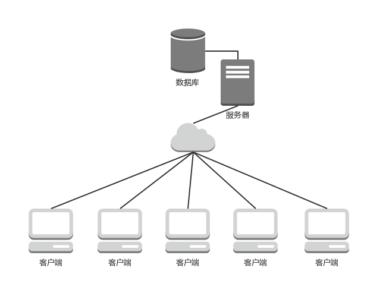
## <div id="4-2"> 4.2 详细设计
### <div id="4-2-1"> 4.2.1 客户端功能模块设计
客户端是该项目的重要部分，承担了大部分的核心功能，也是内容最多、结构最复杂的部分，因此对客户端的设计非常重要，下面将对客户端进行多层次、多模块的拆分，分别进行设计。
根据需求分析，客户端的主要功能包括：两大用户参与模式、创作内容的数据排行。如图 4.2 所示，展示了客户端状态之间的迁移，同时也是界面场景的转换，将上述功能串联在一起，由于状态图中内容较多，默认的用户返回操作在图中省略。
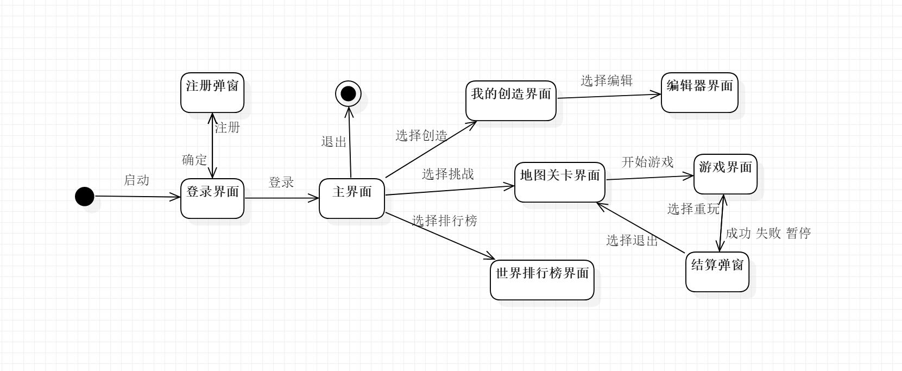

根据客户端的功能，将客户端分为三大模块：编辑器模块、游玩体验模块、其它模块，如图 4.3 所示：
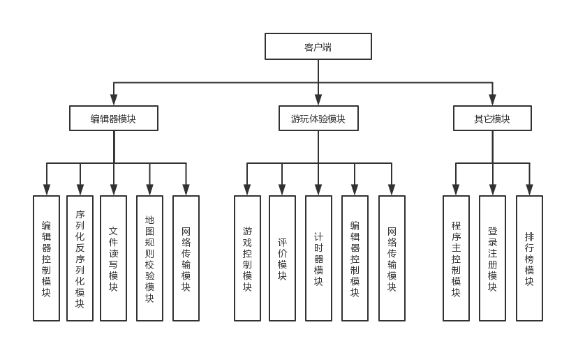

1. 游玩体验模块

游玩体验模块的核心是正常的游戏流程，用户选定一个地图关卡打开之后即进入游戏流程，游戏场景中根据地图关卡配置文件进行动态加载，有唯一的角色起始点和终点，用户需要在倒计时内抵达终点，途中角色会与地图中的不同类型组件产生不同的交互。
    
> 1. 游戏管理器：游戏管理器负责整个游戏过程中的生命周期管理和调度，接收计时器的倒计时结束事件、角色模块的死亡事件和终点模块的触发事件，用于判断游戏的胜利和失败，同时还需要根据当前状态来管理 UI 和弹窗，提供游戏重来、暂停、恢复的生命周期功能。
> 2. 角色控制器和相机：角色控制器采用输入控件和角色操控控件分离的方式，输入控件负责监听输入设备的事件，例如本项目中基础需要支持键盘输入，就需要有键盘的输入控件，如果后续有移植其它平台或拓展输入设备的时候，可以新增具体的控件例如手柄控件或触摸屏控件等。角色操控控件是具体操纵角色刚体运动和角色动画的部分，接收某一具体输入控件的消息，这样只需要保证不同输入控件发送给角色操控控件的事件规范是一致的即可。同时角色始终保持在视口中相对固定的位置上，所以相机的位置保持和角色位置变化一致。
> 3. 计时器：计时器负责整个游戏过程中的时间管理，包括时间限制倒计时和用户用时记录，在倒计时结束时会向游戏管理器发送倒计时结束事件，如果是抵达终点事件触发，游戏管理器可以通过计时器来获取用户的用时。
> 4. 终点：终点模块负责检测角色的位置时候抵达终点，如果角色抵达终点会向游戏管理器发送角色抵达终点事件。
> 5. 组件
>       * Stone：固定在地图场景中固定不动，角色不可从各个角度穿透，会阻碍角色的运动。
>       * Ice：固定在地图场景中，角色踩在其上方会触发融化事件，融化倒计时结束后会消失，在未消失之前角色不可从各个角度穿透，会阻碍角色的运动。
>       * Brick：固定在地图场景中，角色从下方跳起顶到其下方中部会触发破碎事件，触发后直接消失，在未消失之前角色不可从各个角度穿透，会阻碍角色的运动。
>       * Spring：固定在场景中，角色跳跃或下落到其上部时会触发弹起事件，当时会给角色施加一个向上的弹力，角色不可从各个角度穿透，会阻碍角色运动。
>       * Cannon：固定在场景中不动，会以一定时间间隔向两侧发射炮弹，炮弹在达到最大射程或碰到其它物体的时候销毁，如果与角色触碰会触发角色死亡事件。
>       * Sword：原点为 Stone，一定长度的激光柱会以一定速度进行旋转，极光柱和除角色意外的物体不产生碰撞，碰撞角色后会触发角色死亡事件。
>       * Killer：固定在场景中不动，角色从各个角度触碰到该物体后会触发角色的死亡事件。

2. 编辑器模块

编辑器模块是本项目的特色功能所在，用户在其个人创作界面，可以浏览其未发布的地图列表和已发布的地图列表，其中未发布的地图列表提供新建、编辑、发布和删除功能，已发布的地图列表只提供信息数据浏览功能。

>   1. 编辑器管理器：编辑器管理器负责整个编辑器运行的界面调度和模块调用。
>   2. 文件读写模块：用户新建的以及未上传的地图均以本地文件的形式保存，文件读写主要负责新建和编辑功能中对文件的内容读写需求，对底层文件读写接口进行封装。
>   3. 解析和序列化模块：未上传的地图信息以文本的形式保存到文件，程序运行中需要以地图对象的形式进行操作，该模块负责从文件读写模块中读取到的文本的解析，和向文件读写模块写入之前的序列化工作。
>   4. 数据检查模块：该模块用于检查用户编辑的地图信息是否符合标准，其中起点和终点均有且只有一个，并且玩家需要对编辑完的地图进行验证体验通关。
>   5. 网络模块：该模块用于和服务端的数据通信，经过数据检查模块的合法化检查后可以将地图信息发送到服务端，并且可以从服务端获得该用户的所有已上传的地图的数据。

3. 其它模块

其它模块包括了客户端中相对上述两个模块设计规模较小的模块，主要是登录注册模块和排行榜界面。

>   1. 登录注册模块：登录和注册模块选择共用一部分 UI，输入用户名和密码后可以选择登录，也可以选择注册进行下一步的密码验证和输入昵称。这部分模块需要网络模块的支持，登录验证和注册分别使用登录请求和注册请求。
>   2. 排行榜模块：排行榜模块同样用到网络模块，请求服务端获得点赞最多的地图数据和获赞最多的用户数据，该模块根据数据进行界面构建。

### <div id="4-2-2"> 4.2.2 服务端功能模块设计

服务端是该项目的必需部分，负责支持整个项目功能运行。服务端主要包含数据库读写和请求接口实现两大部分，在该项目的运行中，涉及到网络请求的功能较多，因此需要服务端有较强的数据库读写能力和请求处理能力。下面将对服务端进行模块划分，并对其详细分析。

服务端文件结构设计如图 4.4 所示，服务端采用 node.js 运行环境、TypeScript 语言开发、JavaScript 语言执行的方式进行构建。根目录下 src 目录用于储存源代码，即 TypeScript 代码。src 目录下的 index 文件为服务端请求处理和响应部分，dbHelper 文件为数据库操作部分，其余文件分别为各个结构的逻辑实现部分。build 目录下的文件结构和 src 目录下的文件结构一致，为 TypeScript 编译后的 JavaScript 文件，是服务端真正运行的代码。node_modules 目录下为服务端项目所用到的依赖库的文件，由 node.js 的包管理器（npm）自动维护管理的。最后 tsconfig.json 配置文件说明了服务端项目的编译规范，package.json 配置文件说明了项目的基本信息、调试和运行信息和依赖关系。

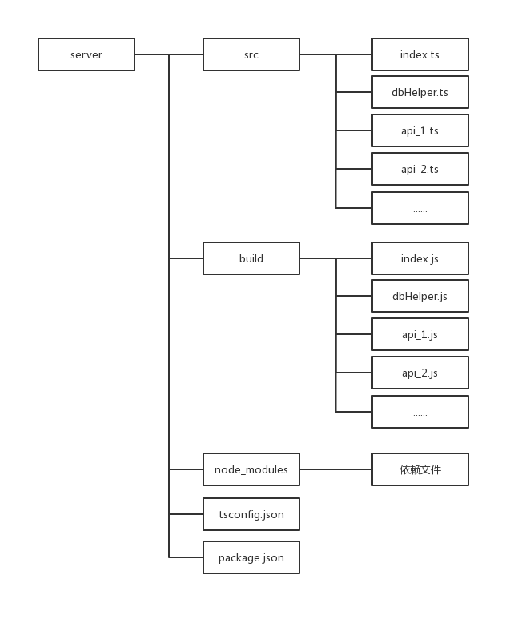

根据服务端的功能需求，将服务端分为请求处理响应模块、接口逻辑实现模块和数据库读写模块，如图 4.5 所示：

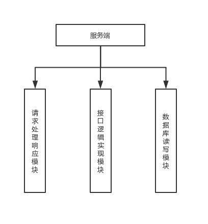

1. 请求处理响应模块

请求处理响应模块是服务端的入口部分，负责构建服务端监听，以及请求的处理和响应。

>   1. IP 及 端口：由于项目需求采用局域网连接的方式，所以服务端部署在局域网内，IP 为部署主机的内网 IP，端口号为 8686。
>   2. 请求类型：服务端只接受 http 协议的 POST 请求，请求数据以 JSON 的形式传输。
>   3. 接口：
>       * signin：登录。
>       * signup：注册。
>       * getMaps：获取所有公共地图的基本信息。
>       * getMapById：根据 ID 获取该地图的全部数据。
>       * uploadMap：上传地图。
>       * upgradeMapInfo：根据 ID 更新该地图的用户关系数据。
>       * getRemoteMapsInfo：获取用户发布的所有地图的基本信息。
>       * getGoodRank：获取点赞数排行榜。
>       * getCreateRank：获取创作数排行榜。
>   4. 响应类型：返回数据以 JSON 的形式序列化，按照 UTF-8 标准编码。

2. 逻辑计算中间层

逻辑计算中间层包括了所有的逻辑代码，负责数据库接口的调用，以及数据的处理和响应数据的构建。同时这部分也是接口的具体实现部分。下面是各个接口的参数和返回数据规范。

>   1. signin
>       * 参数 - username, password
>       * 返回 - error (0 成功，1 密码错误，2 用户名错误) data
>   2. signup
>       * 参数 - username, password, nickname
>       * 返回 - error (0 成功，1 已被占用，2 服务端失败)
>   3. uploadMap
>       * 参数 - map
>       * 返回 - status (0 成功，1 服务端失败)
>   4. getMaps
>       * 参数 - 无
>       * 返回 - error (0 成功，1 服务端错误) maps
>   5. getMapById
>       * 参数 - mid
>       * 返回 - map
>   6. getRemoteMapsInfo
>       * 参数 - uid, username, password, nickname
>       * 返回 - error (0 成功，1 服务端失败) maps
>   7. upgradeMapInfo
>       * 参数 - type, uid, mid, time(可选)
>       * 返回 - error（0 成功，1 已经有了，2 服务端失败）
>   8. getGoodRank
>       * 参数 - user
>       * 返回 - error（0 成功，1 服务器失败）me list
>   8. getCreateRank
>       * 参数 - user
>       * 返回 - error（0 成功，1 服务器失败）me list

3. 数据库读写模块

数据库读写模块负责所有数据库相关的操作，包括数据库的连接和断开，对数据表的增删改查操作等。数据库的所有操作均封装在一个名为 DataBaseHelper 的类中，这个类采用单例模式设计，即服务端进程中全局环境这个类有且仅有一个实例，这样可以方便数据库操作的管理。同时模块中的数据库连接和断开采用连接池的设计，当需要进行数据库操作的时候，从连接池中获取数据库连接，如果池中没有可用连接则创建新的连接，每次数据库操作完成后将连接释放回连接池，这样的设计可以避免反复创建和断开数据库连接，提高运行效率。

### <div id="4-2-3"> 4.2.3 数据库设计

数据库包含五张表，分别为用户表、地图关卡表、通过关系表、点赞关系表和点踩关系表。

单张表遵循第一范式，每张标准的属性均不可再分，同时不同属性之间不存在相同或相似的情况，避免了数据冗余。用户表和地图关卡表之间遵循第二范式，采用一对多关系，即一个用户可以拥有多个地图，地图中以外键（uid）来关联用户，避免了用户其它信息在地图表中的重复造成的冗余。

通过关系表为用户和地图关卡之间的通过关系，一个用户可以通过多个地图关卡，而一个地图关卡也可以被多个用户通过，即用户和地图关卡之间的通过关系为多对多关系，通过关系表中每一条记录则通过外键 uid 来关联用户，通过外键 mid 来关联地图关卡，同时存储通过用时。如上，点赞和点踩关系同样是用户和地图关卡之间的多对多关系。

以下为各个数据表的设计：

1. 用户表

| Field | Type | Length | Unsigned | Binary | Allow NULL | Key | Extra |
|:-----:|:-----:|:-----:|:-----:|:-----:|:-----:|:--------:|:-----:|
| uid   | INT  |  11    | true |          |           | PRI | auto_increment |
|username| VARCHAR | 20 |      |  false   |   false   |     |                |
|password| VARCHAR | 20 |      |  false   |   false   |     |                |
|nickname| VARCHAR | 20 |      |  false   |   false   |     |                |

2. 地图关卡表

| Field | Type | Length | Unsigned | Binary | Allow NULL | Key | Extra |
|:-----:|:-----:|:-----:|:-----:|:-----:|:-----:|:--------:|:-----:|
| mid   | INT   |  11   | true     |        |            | PRI |auto_increment|
| uid   | INT   |  11   | true     |        |            | MUL |              |
| nickname | VARCHAR | 40 |        | false | false |   |      |
| count_down | INT | 11 | true     |        |    false   |    |        |
| width | INT | 11 | true     |        |    false   |    |        |
| height | INT | 11 | true     |        |    false   |    |        |
| start_x | INT | 11 | true     |        |    false   |    |        |
| start_y | INT | 11 | true     |        |    false   |    |        |
| end_x | INT | 11 | true     |        |    false   |    |        |
| end_y | INT | 11 | true     |        |    false   |    |        |
| good_count | INT | 11 | true     |        |    false   |    |        |
| diff_count | INT | 11 | true     |        |    false   |    |        |
| pass_count | INT | 11 | true     |        |    false   |    |        |
| trys_count | INT | 11 | true     |        |    false   |    |        |
| nodes_data | JSON|    |          | true   |    false   |    |        |

3. 点赞关系表

| Field | Type | Length | Unsigned | Binary | Allow NULL | Key | Extra |
|:-----:|:-----:|:-----:|:-----:|:-----:|:-----:|:--------:|:-----:|
| gid   | INT  |  11    | true |          |           | PRI | auto_increment |
| uid   | INT   |  11   | true     |        |         | MUL |              |
| mid   | INT   |  11   | true     |        |         | MUL |              |

4. 点踩关系表

| Field | Type | Length | Unsigned | Binary | Allow NULL | Key | Extra |
|:-----:|:-----:|:-----:|:-----:|:-----:|:-----:|:--------:|:-----:|
| did   | INT  |  11    | true |          |           | PRI | auto_increment |
| uid   | INT   |  11   | true     |        |         | MUL |              |
| mid   | INT   |  11   | true     |        |         | MUL |              |

5. 通过关系表

| Field | Type | Length | Unsigned | Binary | Allow NULL | Key | Extra |
|:-----:|:-----:|:-----:|:-----:|:-----:|:-----:|:--------:|:-----:|
| pid   | INT  |  11    | true |          |           | PRI | auto_increment |
| uid   | INT   |  11   | true     |        |         | MUL |              |
| mid   | INT   |  11   | true     |        |         | MUL |              |
| time   | FLOAT   |     | true     |        |         |     |              |

## <div id="4-2-4"> 4.2.4 数据结构设计
由于本项目客户端和服务端在技术上属于两个技术栈，客户端和服务端之间的通信数据格式采用 JSON 格式，所以无论是客户端还是服务端，都是在程序对象与 JSON 文本之间进行序列化及反序列化。

由于序列化和反序列化发生在两个不同语言环境的地方，所以序列化和反序列化的标准必须要相同，Unity 方面的 C# 语言是强类型语言，在 JSON 解析上非常严格，其数据结构必须要和对应的类的结构一致，稍有差异会导致解析报错。虽然服务端的 JavaScript 语言弱类型脚本语言，并且在对象和属性的处理方面更加灵活，不会因为缺少属性或者多余属性而导致解析报错，但是考虑到软件长期开发过程的健壮性和未来客户端跨平台的可能性，数据结构设计依然保证各个平台和语言环境一直。

以下为本项目中各个数据实体的具体数据结构设计：

1. 用户 User

| 名称   | 类型   | 说明  |
|:-----:|:-----:|:-----:|
|uid |int |用户id |
|username |string |用户名 |
|password |string |密码 |
|nickname |string |昵称 |

2. 位置 Position

| 名称   | 类型   | 说明  |
|:-----:|:-----:|:-----:|
| x | int | 横坐标 |
| y | int | 纵坐标 |

3. 地图节点 NodeInfo

| 名称   | 类型   | 说明  |
|:-----:|:-----:|:-----:|
| pos | Position | 节点位置 |
| prefabType | string | 节点类型 |

4. 地图 Map

| 名称   | 类型   | 说明  |
|:-----:|:-----:|:-----:|
| mid | int | 地图id |
| uid | int | 所属用户id |
| nickname | string | 地图名称 |
| createrName | string | 创作者昵称 |
| goodCount | int | 点赞数 |
| diffCount | int | 点踩数 |
| passCount | int | 通关数 |
| trysCount | int | 挑战数 |
| countDown | int | 时间限制 |
| width | int | 地图宽度 |
| height | int | 地图高度 |
| startPos | Position | 起点位置 |
| endPos | Position | 终点位置 |
| nodeInfo | List<NodeInfo> | 节点数据 |

5. 地图基本信息 MapInfo

| 名称   | 类型   | 说明  |
|:-----:|:-----:|:-----:|
| mid | int | 地图id |
| uid | int | 所属用户id |
| nickname | string | 地图名称 |
| goodCount | int | 点赞数 |
| diffCount | int | 点踩数 |
| passCount | int | 通关数 |
| trysCount | int | 挑战数 |

6. 获赞排行榜 GoodRank

| 名称   | 类型   | 说明  |
|:-----:|:-----:|:-----:|
| uid | int | 用户id |
| rank | int | 排名 |
| nickname | int | 昵称 |
| goodCount | int | 获赞总数 |

7. 创作排行榜 CreateRank

| 名称   | 类型   | 说明  |
|:-----:|:-----:|:-----:|
| uid | int | 用户id |
| rank | int | 排名 |
| nickname | int | 昵称 |
| createCount | int | 创作总数 |

## <div id="4-4"> 4.3 本章小结

本章根据需求分析，对该项目即游戏及编辑器进行了设计。首先说明了该项目的开发环境、使用软件及平台的版本以及目标发布平台的要求，然后从整体角度对该项目进行了总体设计。然后根据总体设计，将项目分为客户端和服务端两部分分别进行设计和建模，详细设计了各个功能模块的具体功能描述和结构，使得后续的编码开发工作能够清晰有序地进行，保证了项目开发的整体质量。最后对根据对数据存储的需求，设计了数据库的表的结构以及表之间的关系。


# <div id="5"> 第五章 游戏及编辑器的功能实现
需求分析和游戏及编辑器的设计为本项目的具体开发实现奠定了基础，本章将描述本项目的具体实现过程，包含了使用 Unity 引擎开发客户端工程和基于 Node.js 开发服务端工程的实现步骤。由于游戏类软件开发是一个复杂的过程，涉及的技术领域较普通软件开发更为广泛，除程序开发之外，还需要大量的美术及音效，显然将实现过程中的每一个细节都详细记录是不现实的，所以本章将着重从程序开发角度进行叙述。
## <div id="5-1"> 5.1 项目工程构建
首先，根据需求及设计要求，本项目的开发需要分别构建客户端工程和服务端工程，以及部署在服务器上的数据库，下面将分别对其进行介绍。
### <div id="5-1-1"> 5.1.1 客户端工程构建
1. 创建 Unity 工程

客户端工程名为 RunnerMaker，使用 Unity 引擎 2018.3.6 版本创建，项目类型为 2D，项目目录结构为标准 Unity 规范。新建 Unity 项目如图 5.1 所示：

<div align=center>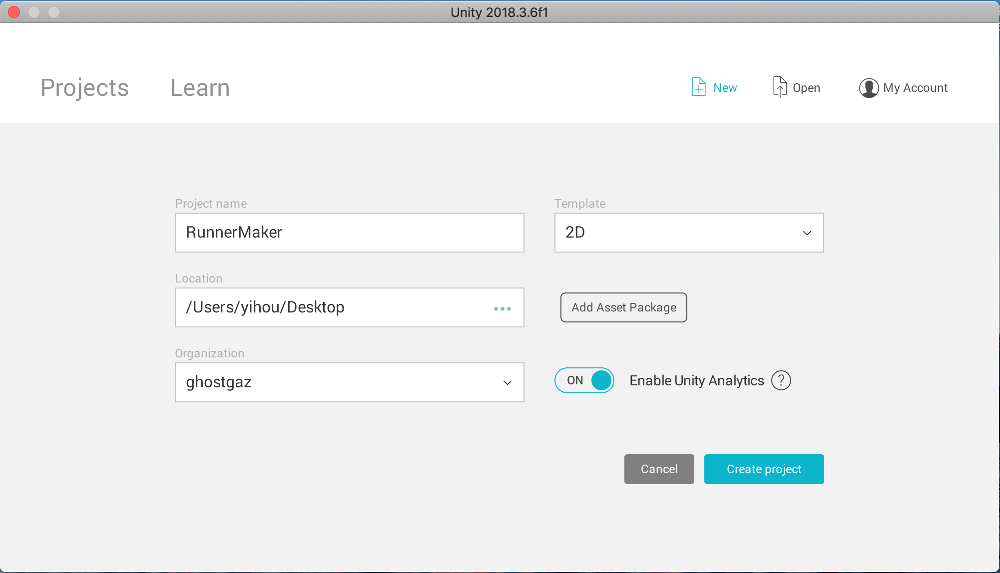</div>

2. 导入龙骨动画（DragonBones）支持库

由于本项目采用 DragonBones 来制作和实现游戏角色动画，所以需要在项目中添加 DragonBones 对 Unity 引擎的支持库，也就是添加 DragonBonesForUnity.unitypackage 文件。在 Unity 编辑器中的资源预览窗口中，在 Assets 目录下右键导入，弹出如图 5.2 所示的弹窗，勾选所有文件后选择导入。

<div align=center>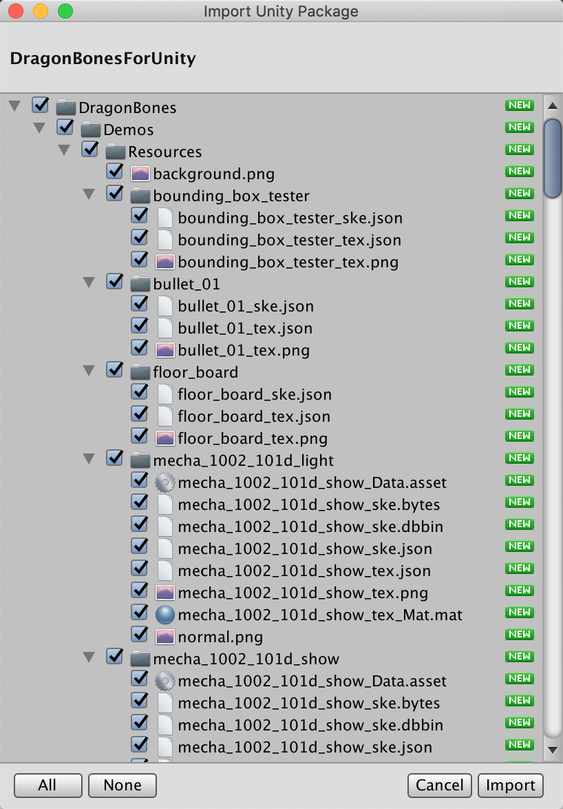</div>

3. 配置版本控制文件

首先在工程目录下通过命令行工具输入命令 “git init” 来初始化 Git 仓库，然后分别创建 .gitigonre 和 .gitattributes 文件，用于说明 Git 仓库的文件监听规则和文本文件行尾规则，如图 5.3 所示：

<div align=center>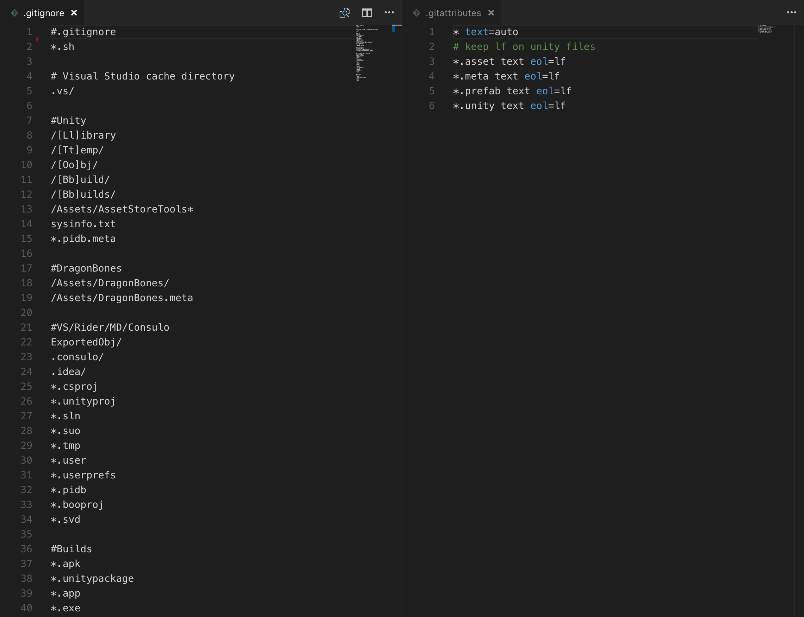</div>

4. 创建游戏场景

客户端项目的界面开发是基于 Unity 引擎的游戏场景（GameScene）的，游戏场景如图 5.x 所示：

<div align=center>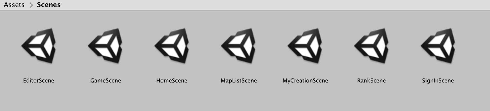</div>

游戏场景和客户端界面的对应关系如下表：

| 游戏场景 | 客户端界面 | 承载功能说明 |
|:---------:|:----------:|:-------------------------:|
| SignInScene | 登录界面 | 用户登录，新用户注册 |
| HomeScene | 主界面 | “我的创作界面”、“挑战列表界面”和“排行榜界面”的入口，退出游戏，注销登录 |
| MyCreationScene | 我的创作界面 | 浏览创作列表，对地图关卡的增、删、发操作，“编辑器界面”的入口 |
| EditorScene | 编辑器界面 | 地图关卡可视化编辑和保存 |
| MapListScene | 挑战列表界面 | 浏览所有网络地图关卡列表，列表排序，“游戏界面”的入口 |
| GameScene | 游戏界面 | 游戏体验，地图关卡评价 |
| RankScene | 排行榜界面 | 浏览创作数排行榜和获赞数排行榜 |

### <div id="5-1-2"> 5.1.2 服务端工程构建
1. 创建 Node.js 工程

服务端工程名为 RunnerMakerServer，首先创建 RunnerMakerServer 文件夹，在文件夹下通过命令行工具执行命令 “npm init” 来初始化 npm 的配置文件。

2. 配置 TypeScript 编译配置文件

同样还在工程根目录下通过命令行工具执行命令 “tsc --init” 来创建 TypeScript 的编译配置文件 tsconfig.json，然后在工程根目录中分别创建 src 和 build 文件夹，用于存放源代码和编译后的目标代码，最后修改 tsconfig.json 文件如图 5.4 所示：

<div align=center>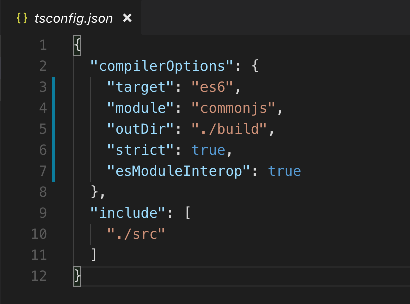</div>

3. 安装环境依赖

由于服务端工程采用从 TypeScript 编译到 JavaScript 的开发方式，并且需要操纵数据库，所以需要添加相关的运行环境依赖，在命令行工具中分别执行 “npm install @types/node”、“npm install @types/mysql” 和 “npm install mysql” 命令。

4. 配置版本控制文件

首先通过命令行工具执行 “git init” 命令来初始化 Git 仓库，然后创建 .gitigonre 文件来说明 Git 仓库的文件监听规则。

### <div id="5-1-3"> 5.1.3 数据库构建

1. 创建数据库

数据库采用 MySQL，储存引擎采用 InnoDB，编码采用 UTF-8，数据库名为 Runner。

2. 根据实体-关系图创建数据表

创建 user 表：
```SQL
CREATE TABLE `user` (
  `uid` int(11) unsigned NOT NULL AUTO_INCREMENT,
  `username` varchar(20) CHARACTER SET utf8 COLLATE utf8_general_ci NOT NULL DEFAULT '',
  `password` varchar(20) CHARACTER SET utf8 COLLATE utf8_general_ci NOT NULL DEFAULT '',
  `nickname` varchar(20) CHARACTER SET utf8 COLLATE utf8_general_ci NOT NULL DEFAULT '',
  PRIMARY KEY (`uid`)
) ENGINE=InnoDB AUTO_INCREMENT=13 DEFAULT CHARSET=utf8;
```

创建 map 表：
```SQL
CREATE TABLE `map` (
  `mid` int(11) unsigned NOT NULL AUTO_INCREMENT,
  `uid` int(11) unsigned NOT NULL,
  `nickname` varchar(40) CHARACTER SET utf8 COLLATE utf8_general_ci NOT NULL DEFAULT '',
  `count_down` int(11) unsigned NOT NULL DEFAULT '0',
  `width` int(11) unsigned NOT NULL DEFAULT '0',
  `height` int(11) unsigned NOT NULL DEFAULT '0',
  `start_x` int(11) unsigned NOT NULL DEFAULT '0',
  `start_y` int(11) unsigned NOT NULL DEFAULT '0',
  `end_x` int(11) unsigned NOT NULL DEFAULT '0',
  `end_y` int(11) unsigned NOT NULL DEFAULT '0',
  `good_count` int(11) unsigned NOT NULL DEFAULT '0',
  `diff_count` int(11) unsigned NOT NULL DEFAULT '0',
  `pass_count` int(11) unsigned NOT NULL DEFAULT '0',
  `trys_count` int(11) unsigned NOT NULL DEFAULT '0',
  `nodes_data` json NOT NULL,
  PRIMARY KEY (`mid`),
  KEY `belong` (`uid`),
  CONSTRAINT `belong` FOREIGN KEY (`uid`) REFERENCES `user` (`uid`)
) ENGINE=InnoDB AUTO_INCREMENT=11 DEFAULT CHARSET=utf8;
```

创建 pass 表：
```SQL
CREATE TABLE `pass` (
  `pid` int(11) unsigned NOT NULL AUTO_INCREMENT,
  `uid` int(11) unsigned NOT NULL,
  `mid` int(11) unsigned NOT NULL,
  `time` float unsigned NOT NULL,
  PRIMARY KEY (`pid`),
  KEY `uid_pass` (`uid`),
  KEY `mid_pass` (`mid`),
  CONSTRAINT `mid_pass` FOREIGN KEY (`mid`) REFERENCES `map` (`mid`),
  CONSTRAINT `uid_pass` FOREIGN KEY (`uid`) REFERENCES `user` (`uid`)
) ENGINE=InnoDB AUTO_INCREMENT=4 DEFAULT CHARSET=utf8;
```

创建 good 表：
```SQL
CREATE TABLE `good` (
  `gid` int(11) unsigned NOT NULL AUTO_INCREMENT,
  `uid` int(11) unsigned NOT NULL,
  `mid` int(11) unsigned NOT NULL,
  PRIMARY KEY (`gid`),
  KEY `uid_r` (`uid`),
  KEY `mid_r` (`mid`),
  CONSTRAINT `mid_r` FOREIGN KEY (`mid`) REFERENCES `map` (`mid`),
  CONSTRAINT `uid_r` FOREIGN KEY (`uid`) REFERENCES `user` (`uid`)
) ENGINE=InnoDB AUTO_INCREMENT=3 DEFAULT CHARSET=utf8;
```

创建 diff 表：
```SQL
CREATE TABLE `diff` (
  `did` int(11) unsigned NOT NULL AUTO_INCREMENT,
  `uid` int(11) unsigned NOT NULL,
  `mid` int(11) unsigned NOT NULL,
  PRIMARY KEY (`did`),
  KEY `uid_diff` (`uid`),
  KEY `mid_diff` (`mid`),
  CONSTRAINT `mid_diff` FOREIGN KEY (`mid`) REFERENCES `map` (`mid`),
  CONSTRAINT `uid_diff` FOREIGN KEY (`uid`) REFERENCES `user` (`uid`)
) ENGINE=InnoDB AUTO_INCREMENT=2 DEFAULT CHARSET=utf8;
```

3. 可视化数据库管理软件

在本项目的初期阶段，由于采用局域网内部署，服务端和数据库部署在了一台 macOS 计算机上，所以采用了 Sequel Pro 作为可视化数据库管理软件，界面如图 5.5 所示：

<div align=center>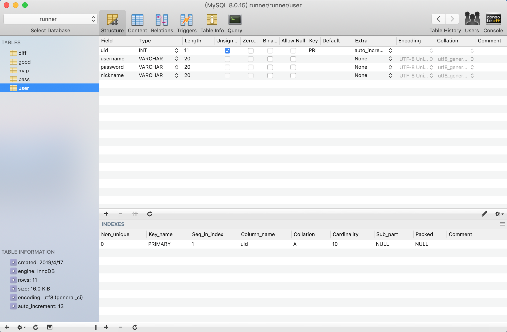</div>

## <div id="5-2"> 5.2 客户端通用功能模块
独立模块在本项目中是指客户端中较为通用的功能模块，就是将一些基础功能和可复用的代码进行提取和封装，形成一个独立的模块，方便项目中的其它地方进行调用。这也是符合面向对象程序设计原则中的单一职责原则的，把所有具有相同功能职责的代码抽象成一个对象，而又保证对象的功能职责都是和自己定位相关的。

由于 Unity 引擎的开发方式所决定，可以将类归为两大部分，一种是继承自 Unity 的 MonoBehavior 基类，这种类也就是 “游戏对象-组件”（GameObject-Component） 开发模式中的组件，需要挂载到游戏对象上，有多少个挂载该组件的对象，那么这个组件就会被实例化多少次，同时由于组件是和游戏对象强关联的，所以一般情况下需要对游戏对象进行操作或者逻辑和生命周期有关联的代码，会采用这种方式进行编写。第二种则是更偏向于传统意义上的类，这样的类一般用来处理和 Unity “游戏对象-组件” 开发模式关联不大的功能，所以一般情况下不需要操作具体游戏对象并且不需要和 Unity 生命周期强关联的代码会采用这种写法。

根据软件设计，一共有四个模块可以归类为独立模块，并且在开发中属于上述第二种类型，本节将详细叙述独立模块的实现过程以及采用的设计模式。

### <div id="5-2-1"> 5.2.1 单例模式设计
单例模式（Singleton Pattern），又称单件模式，是经典软件设计模式中的一种，其定义为：一个类在程序生命周期中有且仅有一个实例化对象，并向全局提供一个调用接口。

本节中的独立模块实现，从实现角度上来看，都是非常适合采用单例模式设计的，例如网络模块和文件读写模块，都是功能较为单一并且存在耗时操作的，同时也和游戏对象和生命周期没有关联，如果使用多实例的方式编写，容易造成多次实例化的时间开销和空间资源浪费。再例如对象池和场景数据通信模块，这类模块都是具有数据敏感性的，如果采用多实例的方式，不仅造成空间资源浪费，还容易引发程序运行中数据使用的错误。

单例模式的实例化方式分为两种，一种是在程序启动的时候自行实例化，等待调用；另一种是在外界第一次调用的时候进行实例化。联系到 Unity 开发的实际，使用 C# 语言实现单例模式，采用第二种实例化方式，单例模式类图如图 5.6 所示：

<div align=center>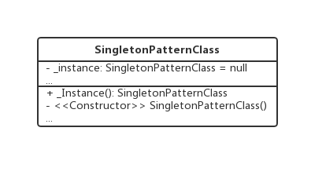</div>

类中真正的实例是 _instance，这是一个静态属性，默认初始值为空。类中可以公共访问的是 _Instance，同样这也是一个静态属性，并且采用实现 getter 的方法来检查 _instance 是否为空，若为空则调用构造方法来进行实例化。单例模式类的构造方法访问权限为私有，避免了外部对其进行多次实例化，单例模式类的访问流程如图 5.7 所示：

<div align=center>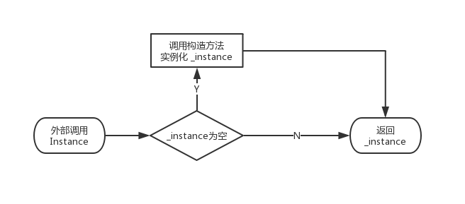</div>

### <div id="5-2-2"> 5.2.2 通用模块实现

1. 网络模块

本项目的服务端是部署在局域网环境中的，并且客户端和服务端的通信均采用 Http 协议的 POST 方法，所以网络模块类（NetHelper）只拥有 Post 一个公共方法，NetHelper 类图如图 5.8 所示。

<div align=center>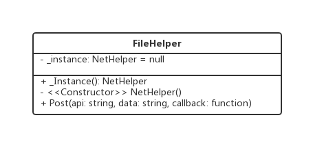</div>

由于网络访问时局域网中进行的，所以客户端中的网络请求地址格式为 “协议名称://局域网 IP 地址:端口号/目标接口”。而 NetHelper 类中的 host 属性就是请求地址的前半部分，外部调用的时候只需要提供具体的接口名称即可。网络请求是耗时操作，而游戏又具有画面需要频繁更新的特性，所以为了防止网络请求耗时过长而造成画面卡顿，NetHelper 采用了回调函数的方式来实现异步访问。

Post 方法需要两个必选参数分别为接口名称和请求数据，和一个可选参数是回调函数，该回调函数接收一个字符串参数。Post 方法流程如图 5.9 所示，首先根据主机地址和接口名称实例化一个请求对象（HttpWebRequest），然后设置其请求方法为 “POST”、内容类型为 “application/json”，将请求数据从字符串类型编码为字节数组并将其写入到请求流中，接下来发送 http 请求，在接收到响应后将响应数据编码为字符串类型并调用回调函数。

<div align=center>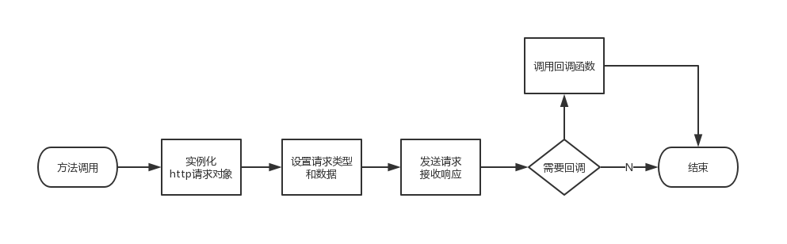</div>

2. 文件读写模块

根据设计，客户端中用户在编辑器中编辑保存的地图是以文件形式保存在客户端本地。文件读写模块（FileHelper）的类图如图 5.10 所示。模块中提供了同步读取和写入、异步读取和写入以及文件删除这五个方法。

<div align=center>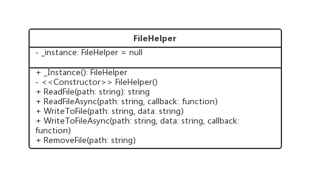</div>

文件读写操作具有一定的特殊性，因为文件操作也属于耗时操作，理想状态下都不应该阻塞程序的刷新，都应该以异步的形式实现。但是特殊情况下使用时，例如集中等待资源加载的时候，使用异步方式调用会使得代码较为杂乱，而同步调用则更为简洁。所以文件读写模块将读取和写入操作分别进行了同步和异步类型的封装实现，以方便程序调用。

3. 对象池

游戏过程中以及编辑器运行过程中，会有频繁的游戏对象创建与销毁，游戏基本类型和项目设计决定了这些游戏对象的种类非常有限，所以其重复度比较高，对同一种类的游戏对象反复进行创建和销毁，为性能带来了极大的隐患，而对象池的引入可以很好地解决这个问题。对象池类图如图 5.11 所示。

<div align=center>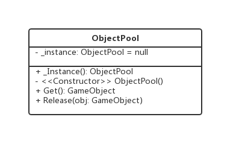</div>

对象池的获取对象方法（Get）调用时，会根据对象队列的状态来决定是否实例化新的对象。对象释放方法（Release）的调用，需要对被释放对象进行重置操作，以保证添加到对象队列中的对象都是相同的状态。

4. 场景数据通信模块

在客户端设计中，每个界面即一个场景，Unity 中的场景切换并不能保留原有场景中的数据，所以需要场景数据通信模块来实现场景切换时的数据传递。该模块中主要包含三类数据的通信，分别是用户登录状态、编辑地图数据和游戏地图数据。

| 通信数据类型   | 写入场景     | 读取场景                           | 说明             |
|:-----------:|:-----------:|:-----------------------------------:|:-----------------------------------------:|
| LoginStatus | 登录界面     | 主界面、我的创造界面、排行版界面、游戏界面 | 储存用户的所有数据 |
| EnterMap    | 挑战列表界面   | 游戏界面                            | 在挑战界面点击选择地图后，保存服务端返回的地图数据 |
| EditeMap   | 我的创造界面   | 编辑器界面                            | 在我的创造界面选择编辑地图，保存从本地读取的地图数据 |

## <div id="5-3"> 5.3 游戏体验模块实现

本节将从界面实现和逻辑实现两大部分，对游戏体验模块的实现进行叙述，由于游戏开发流程较为复杂，并且使用 Unity 引擎开发具有一定的开发定式，所以本节将着重叙述技术要点。

### <div id="5-3-1"> 5.3.1 游戏体验模块界面实现
1. 渲染方式

由于本项目为全 2D 交互和显示，渲染对象全部为图片，所以选用 Sprite 的渲染方式，这是一种专门为 2D 游戏对象和 UI 设计的一种渲染方式。将图片资源导入 Unity 中后，可以在 Unity 的编辑器中对其渲染方式进行更改，如图 5.x 所示：

<div align=center></div>

2. 相机

相机（Camera）是捕获和显示游戏场景中游戏对象的组件。通过自定义相机参数可以获得不同的显示效果，相机的投影方式有两种，一种是透视投影，多用于 3D 场景的拍摄，视觉效果现实中人眼的观察效果相同；另一种是平行投影，多用于 2D 场景和 UI 拍摄，没有近大远小的透视效果，项目中相机的设置如图 5.x 所示：

<div align=center>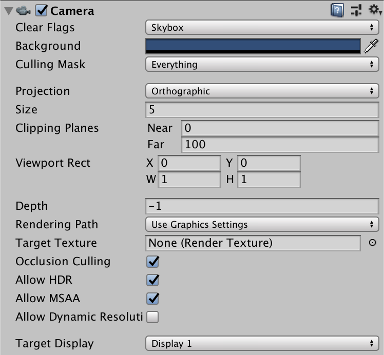</div>

3. 挑战列表场景对象树结构

挑战列表界面对象树结构如图 5.x 所示，由于该界面中均为 UI 元素，没有游戏元素，所以 Canvas 节点下的 UI 对象为所有渲染对象。其中 MapListGroup 节点为地图列表的挂载节点。

<div align=center>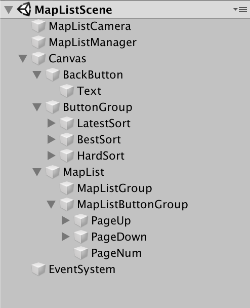</div>

4. 游戏场景对象树结构

游戏界面对象树结构如图 5.x 所示，该界面中所有 Canvas 节点下为所有 UI 对象，其中 ResultWindow 为弹窗界面，正常游戏过程中弹窗是隐藏的。由于游戏场景中是需要有具体游戏对象的，在载入游戏场景时会根据地图数据动态实例化游戏对象，实例化后的游戏对象直接挂在到游戏场景的根节点。

<div align=center>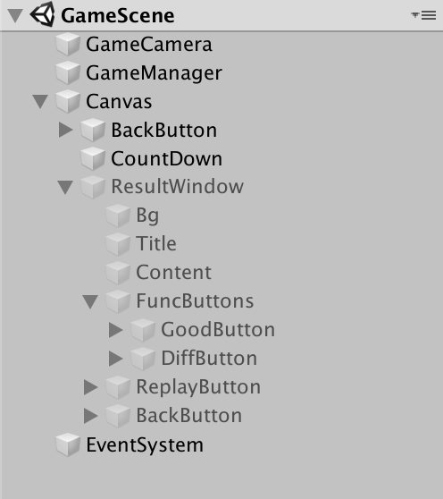</div>

### <div id="5-3-2"> 5.3.2 游戏地图组件实现
游戏地图组件包括了所有需要渲染到游戏场景中的游戏对象，以及在游戏过程中具有逻辑关系的对象，下面将具体叙述各个组件的实现过程。

1. Stone 组件

Stone 组件根据设计要求，只需要固定在地图中并提供和角色各个角度的碰撞，所以只需添加刚体组件和 2D 碰撞体组件，如图 5.x 所示。

<div align=center>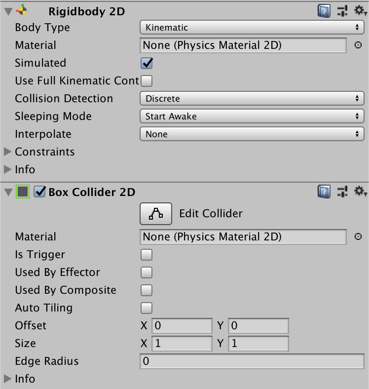</div>

2. Ice 组件

Ice 组件需要在角色触碰到后一定时间后消失，通过添加 Ice 脚本并挂载到对象上，Ice 脚本中会响应 OnCollisionEnter2D 事件。

<div align=center>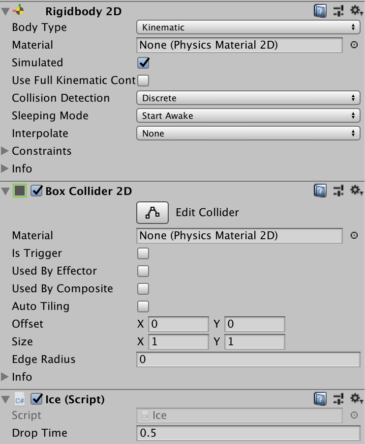</div>

3. Brick 组件

Brick 组件需要在被角色顶到中间位置的时候消失，所以另外在其底部添加了一个触发器，并在 Brick 脚本中响应 OnTriggerEnter2D 事件。

<div align=center>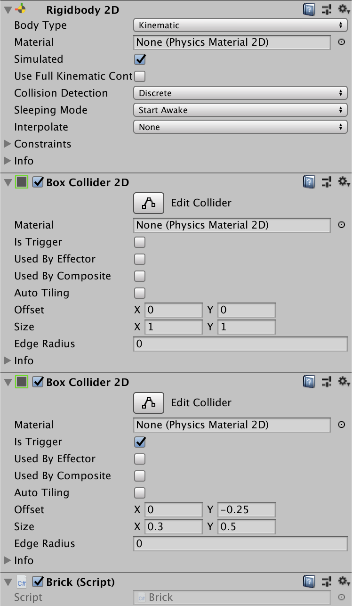</div>

4. Spring 组件

Spring 组件需要在角色落到其上方时给角色施加一个向上的弹力，所以在其上部添加了一个触发器，并在 Spring 组件中通过响应 OnTriggerEnter2D 事件的方式来对角色施加影响，并且可以在 Unity 中配置弹力大小。

<div align=center>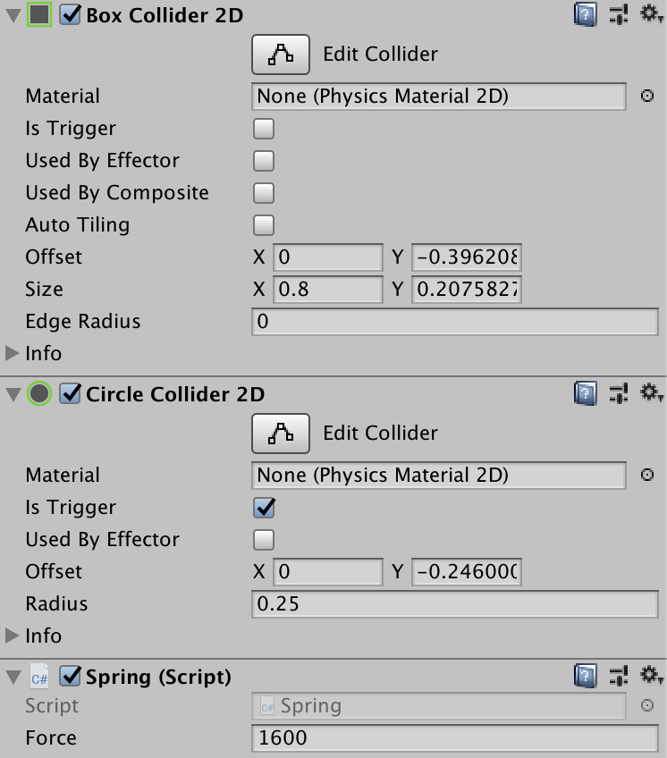</div>

5. Cannon 组件

Cannon 组件是 “大炮” 设计中的炮架子，自身与角色之间没有直接的功能，专门用来创建 Bullet，通过 Cannon 脚本来实现 Bullet 的实例化以及初始化，可以配置其发射的时间间隔。

<div align=center>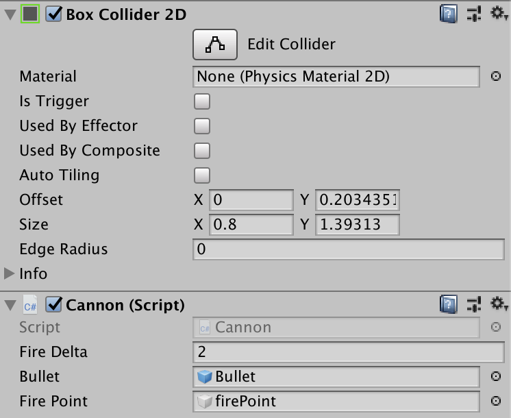</div>

Bullet 是真的需要和角色以及其他组件交互的对象，通过挂载 Bullet 脚本来控制其飞行方向、射程以及飞行速度。由于炮弹的形状不规则，所以使用多边形碰撞器来进行碰撞检测，通过响应 OnCollisionEnter2D 事件来销毁自己或者继续出发角色死亡事件。

<div align=center>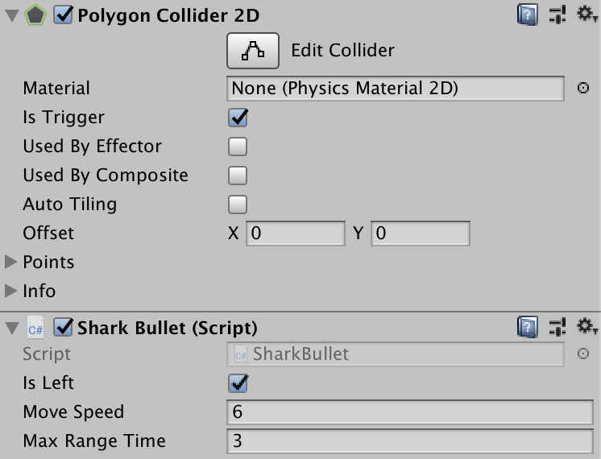</div>

6. Sword 组件

Sword 组件由两部分组成，其基座是 Stone 组件，围绕基座有一个旋转的光柱，通过 Sword 脚本可以配置其旋转速度，并响应 OnTriggerEnter2D 事件来触发角色死亡事件。

<div align=center>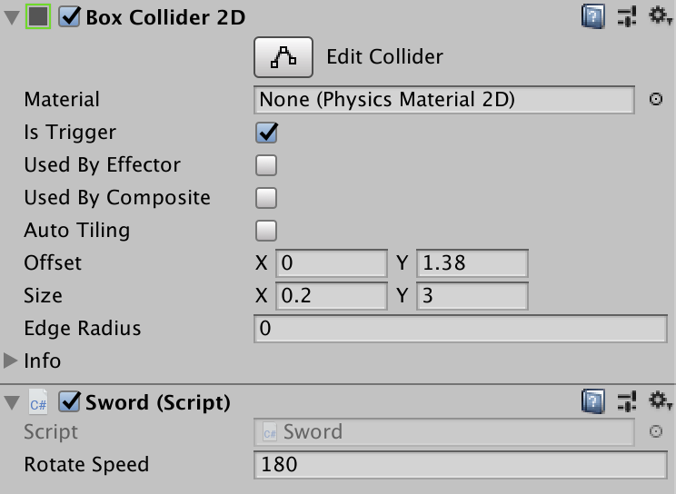</div>

7. Killer 组件

Killer 组件与 Stone 组件的区别在于角色从各个方向碰到 Killer 组件都会造成角色死亡，所以通过 Killer 脚本响应 OnCollisionEnter2D 事件来触发角色死亡事件。

<div align=center>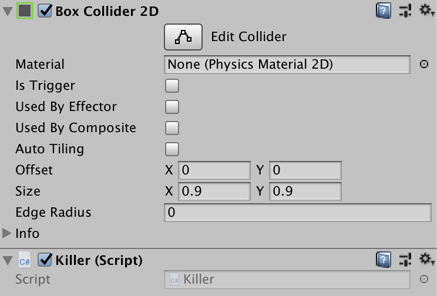</div>

8. Player 组件

Player 组件即玩家角色，起初角色的碰撞器只使用了一个矩形碰撞器，在测试中发现角色在横向移动过程中可能会和地图中其它组件产生预期外的碰撞阻拦效果，所以后面采用了双碰撞器的设计。角色底部使用椭圆形碰撞器，头部使用矩形碰撞器，解决问题的同时进一步优化了角色碰撞器和角色本身的契合程度。

PlayerController 脚本负责角色的控制，包括接收和处理输入设备管理器（InputManager）的控制指令，来修改角色对象的运动状态和控制动画播放。

<div align=center>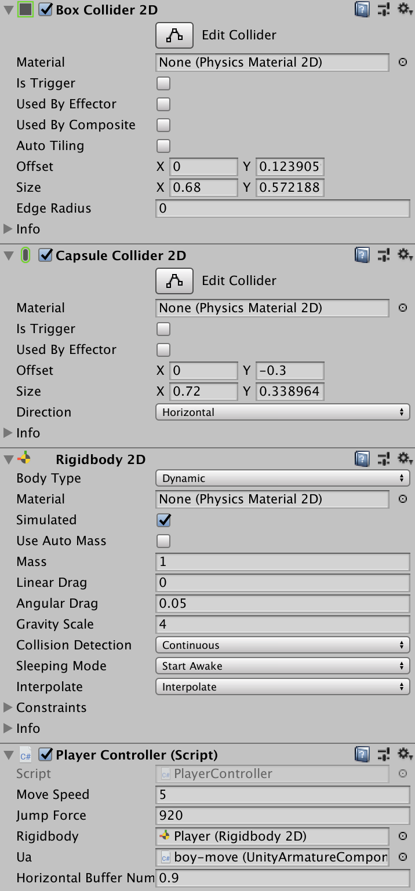</div>

角色在移动中是有动画的，本项目中的动画采用龙骨动画（DragonBones）的序列帧动画制作，角色动画组件如图 5.x 所示，选择播放 “boy-move” 动画，并设置播放速度为两倍。

<div align=center>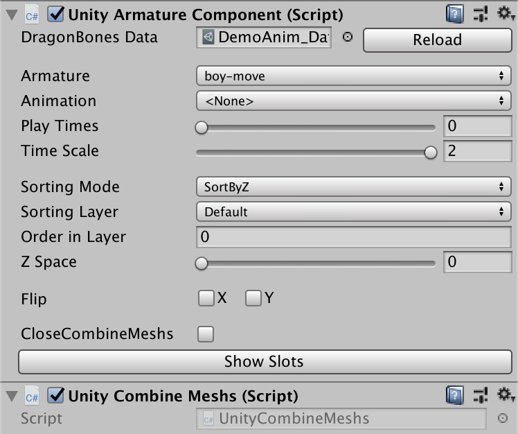</div>

9. End 组件

End 组件为游戏地图终点，由于没有碰撞设计所以只有包含一个触发器，并且通过 End 脚本响应 OnTriggerEnter2D 事件来触发通关成功游戏结束事件。

<div align=center></div>

### <div id="5-3-3"> 5.3.3 游戏体验模块管理器实现
游戏体验模块的功能借助 Unity 的预制体技术、“游戏对象-组件”模式，通过编写逻辑代码共同实现，实现流程如图 5.x 所示。其中构建渲染地图列表、场景切换载入、地图游戏对象构建以及物理状态触发的底层实现为 Unity 提供功能，其余部分为代码逻辑实现。

<div align=center>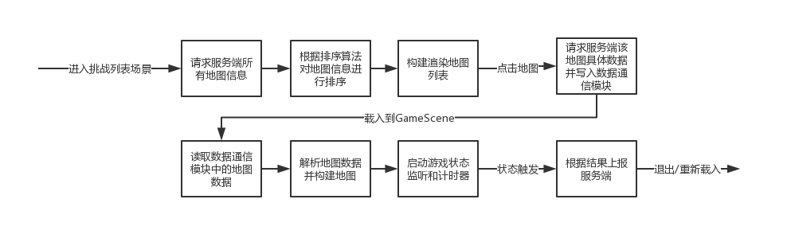</div>

1. 排序算法实现

地图列表数据的排序共有三种方式，分别是根据发布时间、根据点赞数量和根据难度，每次对地图列表数据进行排序和翻页操作，都会触发渲染列表的重新构建和渲染。排序算法通过创建继承自 Comparer<T> 的类并重写其 Comparer 方法来实现。Comparer 方法比较标准如下表：

| 返回值 | 含义 |
|:-----:|:-----:|
| 小于零 | x 小于 y |
| 零 | x 等于 y |
| 大于零 | x 大于 y |

对于发布时间来排序，根据每个地图关卡的 mid 由大到小排序即可。对于点赞数量排序，根据每个地图关卡的 goodCount 由大到小排序即可。最后对于难度排序，排序标准为 “通过数 / 尝试数” 有小到大排序，考虑到通过数和尝试数均有可能为零的情况，算法实现为如果该地图关卡尝试数为零，则认为难度较低排在后面，如果通过数为零而尝试数不为零，则以其通过数为 1 来计算系数，同时认为其难度大于同系数下通过数大于零的地图，在同系数中排在前面。

2. 渲染列表构建实现

渲染列表构建的流程分为三步。第一步，遍历删除渲染列表节点的所有子节点，清空渲染对象。第二步，根据当前列表页码确定需要渲染的地图列表区间，使用该区间的地图数据来实例化地图渲染预制体，并挂载到渲染列表节点下。第三步，更新列表页码的显示。

3. 地图及游戏对象构建

地图及游戏对象构建的流程分为五步。第一步，从 EnterMap 数据通信模块中读取地图数据，并将其序列化为 C# 对象。第二步，创建计时器对象，并初始化计时器状态。第三步，根据起点和终点位置信息，创建起点角色和终点对象。第四步，根据各个模块的位置信息和类型，分别创建不同种类的游戏组件。第五步，根据地图尺寸信息构建地图边界对象，使游戏过程的可能性封闭。

4. 游戏事件管理及控制实现

游戏事件管理可分为两大类，一是 Unity 自带的事件管理，二是自己实现的事件。其中 Unity 自带的事件管理在本项目中也就是物理触发器事件，即玩家角色和各个游戏组件 Collider 和 Trigger 之间的触发事件。而自己实现的事件即游戏倒计时结束事件。物理触发事件效果较多，例如组件状态改变、对角色施加效果、角色死亡、到达终点等等，其中角色死亡事件或者倒计时结束的事件触发会进入到通关失败游戏结束的逻辑调用，而到达终点的事件触发会进入到通关成功游戏结束的逻辑调用。

## <div id="5-4"> 5.4 地图编辑器模块实现

本节将从界面实现和逻辑实现两大部分，对编辑器模块的实现进行叙述，由于游戏开发流程较为复杂，并且使用 Unity 引擎开发具有一定的开发定式，所以本节将着重叙述技术要点。

### <div id="5-4-1"> 5.4.1 地图编辑器界面实现

1. 我的创作场景对象树结构

我的创作界面场景对象结构如图 5.x 所示，该场景中的渲染对象均为 UI 对象，Canvas 节点下的所有对象为基础 UI ，NewMapWindow 节点所表示的画布则专门用来构建新建地图时的输入弹窗。

<div align=center>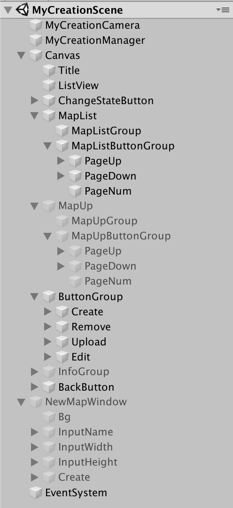</div>

其中地图渲染列表分为两种，一是本地编辑未上传的地图列表，即 MapList；二是该用户已经上传的地图列表，即 MapUp。这两个渲染节点各自都有用来挂载地图项的节点和翻页系统，并且两个渲染节点在不能同时显示，可以通过 ChangeStateButton 来改变两个渲染节点的 active 来实现显示状态的切换。

2. 编辑器场景对象树结构

编辑器场景对象树结构如图 5.x 所示，该场景中 Canvas 节点下均为 UI 对象，
包含界面上方的游戏地图组件的选择按钮、倒计时输入框和保存按钮。另外，该场景中还包括两大部分游戏对象，一是为了方便可视化编辑根据尺寸将地图网格化的网格线对象，二是编辑模式中用户添加的游戏组件对象。

<div align=center>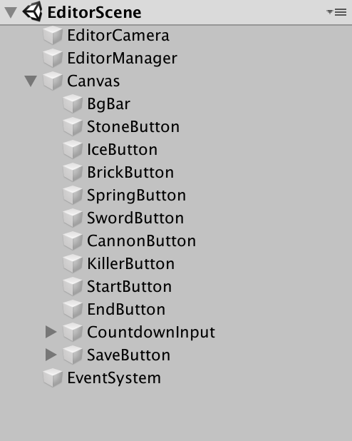</div>

### <div id="5-4-2"> 5.4.2 编辑模式组件

编辑器场景的地图组件不能和游戏场景中的组件共用，原因是如果使用了游戏场景中的地图组件，一旦用户在编辑器中点击创建了一个组件，那么这个组件上的脚本就会和 Unity 生命周期关联起来，开始计算更新和事件响应，例如初始创建出角色，那么这个角色就会因为物理引擎更新的原因而开始下落，这是不符合对编辑器模式的需求和预期的。

为了处理这个问题，考虑到编辑器模式下，地图组件只需要进行静态展示，可视化展示出该位置的组件即可，所以单独为编辑器模式创建了一套独立的地图组件预制体，这套预制体组件只包含一个 SpriteRenderer。

<div align=center>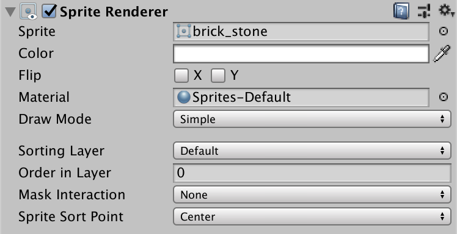</div>

### <div id="5-4-3"> 5.4.3 地图编辑器管理器实现

编辑器管理器的实现流程主要包括两部分，一是用户编辑和保存流程，如图 5.x 所示；二是用户试玩地图并进行通关验证的流程，如图 5.x 所示。前者只涉及到我的创作界面以及编辑器界面，而后者需要以试玩的模式进入到游戏界面中。

<div align=center>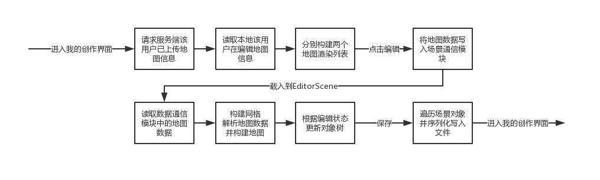</div>

<div align=center>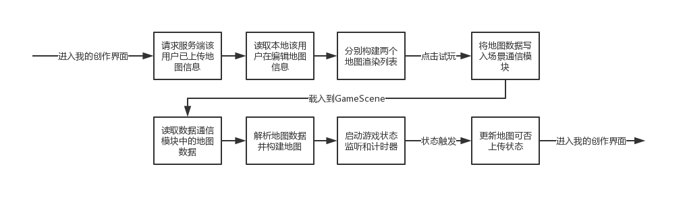</div>